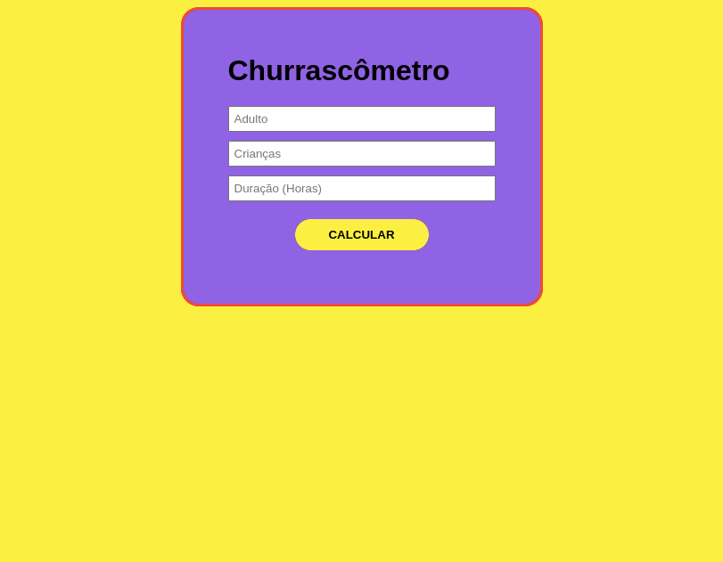

# Churrascômetro
.
<h2>Projeto</h2>

Comprar a quantidade certa de ingredientes para o churrasco não é uma tarefa fácil. Por isso, criei uma ferramenta para ajudá-lo nas compras e deixar seu churrasco ainda mais gostoso.

Acesse agora clicando <a href="https://viktor-ariel.github.io/churrascometro/">aqui</a>

<h2>Tecnologias</h2>

- HTML 

- CSS 

- JS 

<h2>💚Contato</h2>

viktorariel777@gmail.com

